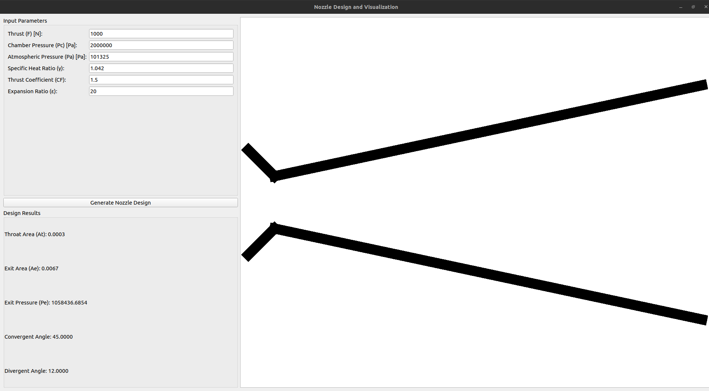

# 노즐 설계와 시각화 알고리즘

## 개요
이 알고리즘은 로켓 노즐의 주요 설계 요소를 계산하고, 이를 바탕으로 2D 형상을 시각화합니다. 설계에는 입력된 추진력(추력), 연소실 압력, 대기압, 비열비, 추력 계수, 그리고 팽창비를 사용합니다. 또한 설계된 노즐을 blender를 통해 3d모델로 반환하는 기능도 제공합니다.

---

## 입력 파라미터
- **Thrust ($F$)**: 설계 추력 (뉴턴, $N$)
- **Chamber Pressure ($P_c$)**: 연소실 압력 (파스칼, $Pa$)
- **Atmospheric Pressure ($P_a$)**: 대기압 (파스칼, $Pa$)
- **Specific Heat Ratio ($\gamma$)**: 비열비 (무차원, 주로 1.042~1.044)
- **Thrust Coefficient ($C_F$)**: 추력 계수 (무차원)
- **Expansion Ratio ($\varepsilon$)**: 팽창비 (출구 단면적/노즐 목 단면적 비율)

---

## 주요 계산 항목
### 1. 노즐 목 단면적 ($A_t$)
노즐 목 단면적은 다음의 추력 방정식을 변형하여 계산합니다:
$$
A_t = \frac{F}{C_F \cdot P_c}
$$

- $F$: 추력
- $C_F$: 추력 계수
- $P_c$: 연소실 압력

### 2. 노즐 출구 단면적 ($A_e$)
출구 단면적은 팽창비를 사용하여 계산합니다:
$$
A_e = \varepsilon \cdot A_t
$$

- $\varepsilon$: 팽창비
- $A_t$: 노즐 목 단면적

### 3. 출구 압력 ($P_e$)
출구 압력은 등엔트로피(isentropic) 팽창 조건을 가정하여 다음과 같이 계산합니다:
$$
P_e = P_c \cdot \left( \frac{2}{\gamma + 1} \right)^{\frac{\gamma}{\gamma - 1}} \cdot \varepsilon^{-\frac{\gamma - 1}{\gamma}}
$$

- $P_c$: 연소실 압력
- $\gamma$: 비열비
- $\varepsilon$: 팽창비

### 4. 수축부 각도 (Convergent Angle)
수축부 각도는 최적의 하위음속 조건을 가정하여 일반적으로 $45^\circ$로 설정됩니다.

### 5. 확장부 각도 (Divergent Angle)
확장부 각도는 팽창비에 따라 다르게 설정됩니다:
- $\varepsilon < 10$: $15^\circ$
- $10 \leq \varepsilon < 50$: $12^\circ$
- $\varepsilon \geq 50$: $10^\circ$

---

## 2D 노즐 형상 생성
### 계산된 기하학적 요소
1. **노즐 목 반지름 ($r_t$)**:
$$
r_t = \sqrt{\frac{A_t}{\pi}}
$$

2. **출구 반지름 ($r_e$)**:
$$
r_e = \sqrt{\frac{A_e}{\pi}}
$$

3. **수축부 길이**:
$$
L_{\text{conv}} = \frac{r_{\text{inlet}} - r_t}{\tan(\theta_{\text{conv}})}
$$
- $\theta_{\text{conv}}$: 수축부 각도

4. **확장부 길이**:
$$
L_{\text{div}} = \frac{r_e - r_t}{\tan(\theta_{\text{div}})}
$$
- $\theta_{\text{div}}$: 확장부 각도

5. **노즐 전체 길이**:
$$
L_{\text{total}} = L_{\text{conv}} + L_{\text{div}}
$$

---

## 출력
1. **계산된 설계 파라미터**:
   - 노즐 목 단면적 ($A_t$)
   - 출구 단면적 ($A_e$)
   - 출구 압력 ($P_e$)
   - 수축부 각도
   - 확장부 각도

2. **2D 시각화**:
   - 수축부와 확장부를 포함한 노즐의 단면도를 화면에 그려줌.

---

## 사용 예시
### 입력값
- $F = 1000 \, \text{N}$ (추력)
- $P_c = 2 \times 10^6 \, \text{Pa}$ (연소실 압력)
- $P_a = 101325 \, \text{Pa}$ (대기압)
- $\gamma = 1.042$ (비열비)
- $C_F = 1.5$ (추력 계수)
- $\varepsilon = 20$ (팽창비)

### 출력값
- $A_t = 0.0003333 \, \text{m}^2$ (노즐 목 단면적)
- $A_e = 0.0066667 \, \text{m}^2$ (출구 단면적)
- $P_e = 37847.23 \, \text{Pa}$ (출구 압력)
- 수축부 각도: $45^\circ$
- 확장부 각도: $12^\circ$ (팽창비가 중간 크기인 경우)

